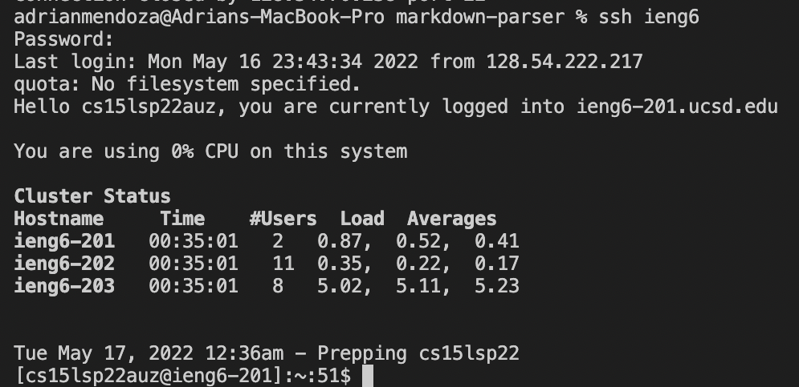

# Streamlining ssh Configuration

## Config file

## Login with alias

## File copy using alias

# Setup Github Access from ieng6

## Public key on GitHub

## Private key on user account

## Commit and push changes using git commands

## Resulting commit link
[Git Commit Link](https://github.com/adrianmend25/Lab-Report-2/commit/eac575ffe0ebefa3f182c955839232fac472a8e5)

# Copy whole directories with scp -r
 
## Markdown-parse directory copy onto ieng6

## Logging onto ieng6 and compliling and runnning tests

## Copy directory and run tests in one line

